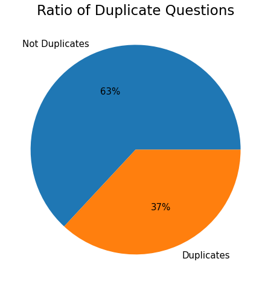
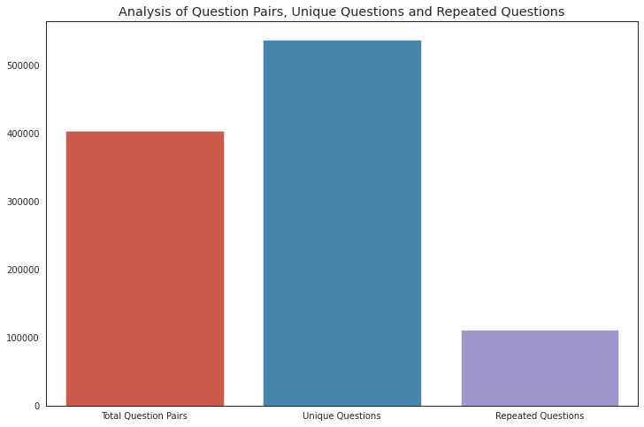
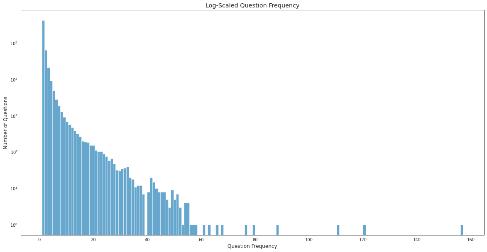
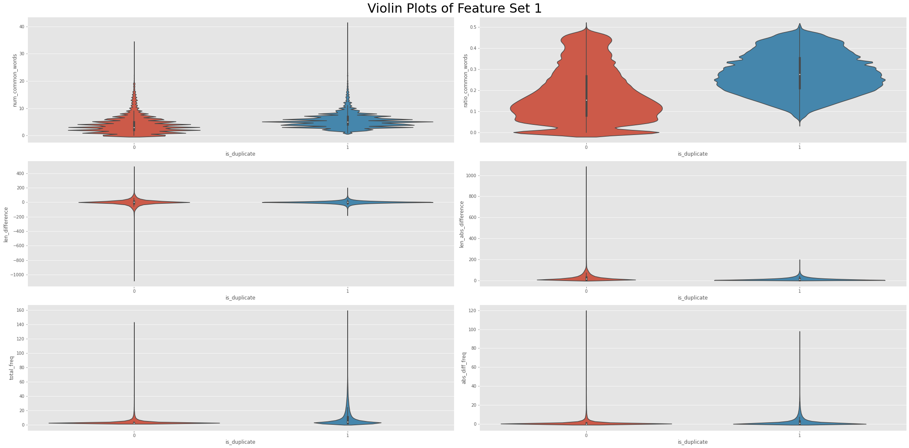
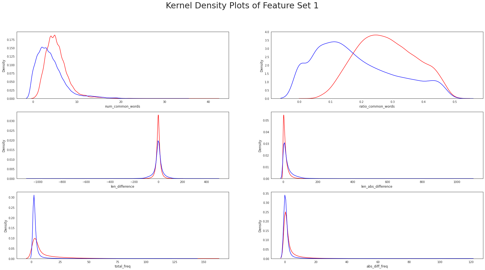
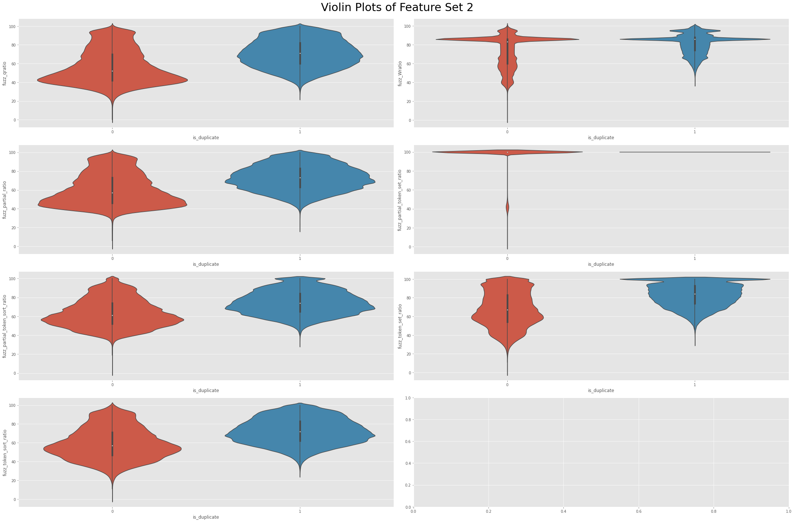

# NLP with Quora Questions
## Overview
In this repository I explore different methods of Natural Language Processing on the Quora Questions database. The goal is to determine if two questions are identical. This is an important feature for a business like Quora where they have millions of users: if they can accurately determine if questions are similar then they can reduce their overhead by using a cached answer instead of accessing a database.

## Table of Contents
  1. [**EDA**](https://github.com/Graham-Broughton/NLP-Quora/edit/master/README.md#EDA)
  2. [**Feature Engineering**](https://github.com/Graham-Broughton/NLP-Quora/edit/master/README.md#FeatureEngineering)
  3. [**Baseline Model**](https://github.com/Graham-Broughton/NLP-Quora/edit/master/README.md#Logistic-Regression)
  4. [**XGBoost**](https://github.com/Graham-Broughton/NLP-Quora/edit/master/README.md#XGBoost)

## EDA
For my exploratory data analysis I analyzed the target distribution, various features of the questions and target distribution among engineered question features. I discovered a slight class imbalance, shown below, and proceeded with baseline models without any correction. 

     
    

Out of the 404290 question pairs there were 537933 unique questions, 111780 repeated questions with a maximum repeat of 157. When seperated by target, there were more repeated questions in the duplicate class than there should have been according to the class distribution (44% instead of 37%).

     

The log-scaled histogram of repeated questions, seen below, shows the vast majority of questions are either not repeated, or repeated a few times, with an extremely long tail.

There were also three NaN values which I chose to impute with an empty string. This way, if Quora does not have a safeguard against empty queries, the model will be able to handle them.

## Feature Engineering
The big problem with NLP is that computers cannot understand language as is, we need to transform it into something the computers can: numbers. I started with basic engineering by extracting basic statistics of the questions, then used more advanced tools including: the FuzzyWuzzy library, TF-idf Vectorizer and Truncated SVD, word vector embeddings and an assortment of distances between those embeddings. My basic engineering consisted of calculating: character length, difference of character length, absolute difference of character length, number of words, number of common words, ratio of common words, frequency of questions, frequency of both questions, absolute difference of frequencies and the sets of characters used. As seen in the violin and kernel plots, the number and ratio of common words will likely be an effective feature due to the difference of values between classes.

FuzzyWuzzy is a python library for string matching which uses Levenshtein distance to compare the differences between the strings. Essentially it calculates the number of single character edits the two strings differ from one another. It also has more advanced partial matching for when a shorter string is a substring of a longer one for example, 'Vancouver Canucks' vs. 'Canucks'. The violin plots for this feature set look like they will be important but ratio and number of common words still have the most class seperation.

Term Frequency-Inverse Document Frequency (TF-idf) is another method of transforming text into vectors computers can understand. Term frequency refers to the matrix composed of word occurences in each sentence where each row is a sentence and each column is a word and the values are the number of occurences. Inverse document frequency is the log of total documents divided by the number of documents the term appears in, so the more often the word appears, the lower the idf score. TF-idf is simply the product of the term frequency matrix and idf values. The idea is to capture which words are important to that particular sentence in an easy to understand form for computation. The resulting matrix will be sparse due to the number of words in total vs. number of words in a sentence, so I used truncated singular value decomposition to reduce the dimensionality of the matrix to the average number of words per sentence. I applied this method a few different ways. First method was to calculae TF-idf on each question, horizontally stack the results in an array, then perform tSVD. Second method was combine the questions, then perform TF-idf and tSVD. The last method was to use TF-idf and tSVD and the questions seperately, then stack the results in an array.
