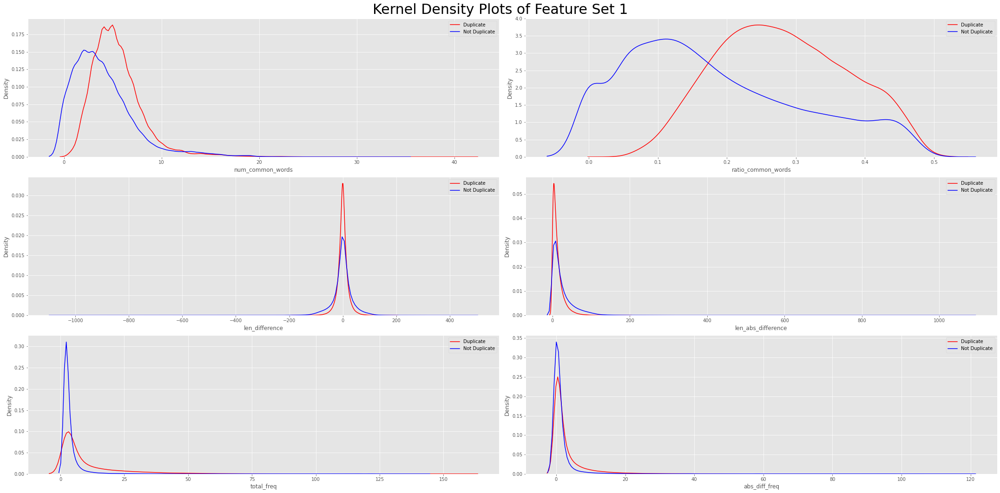

# NLP with Quora Questions
## Overview
In this repository I explore different methods of Natural Language Processing on the Quora Questions database. The goal is to determine if two questions are identical. This is an important feature for a business like Quora where they have millions of users: if they can accurately determine if questions are similar then they can reduce their overhead by using a cached answer instead of accessing a database.

## Table of Contents
  1. [**EDA**](https://github.com/Graham-Broughton/NLP-Quora/edit/master/README.md#EDA)
  2. [**Feature Engineering**](https://github.com/Graham-Broughton/NLP-Quora/edit/master/README.md#FeatureEngineering)
  3. [**Baseline Model**](https://github.com/Graham-Broughton/NLP-Quora/edit/master/README.md#Logistic-Regression)
  4. [**XGBoost**](https://github.com/Graham-Broughton/NLP-Quora/edit/master/README.md#XGBoost)

## EDA
For my exploratory data analysis I analyzed the target distribution, various features of the questions and target distribution among engineered question features. I discovered a slight class imbalance, shown below, and proceeded with baseline models without any correction. 

Out of the 404290 question pairs there were 537933 unique questions, 111780 repeated questions with a maximum repeat of 157. When seperated by target, there were more repeated questions in the duplicate class than there should have been according to the class distribution (44% instead of 37%).

The log-scaled histogram of repeated questions, seen below, shows the vast majority of questions are either not repeated, or repeated a few times, with an extremely long tail.

To further explore characteristics of the questions I did basic feature engineering which involved calculating: character length, difference of character length, absolute difference of character length, number of words, number of common words, ratio of common words, frequency of questions, frequency of both questions, absolute difference of frequencies and the sets of characters used. The following are violin and kernel density plots of the more interesting engineered features:

